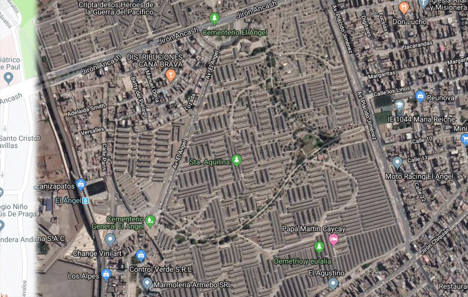
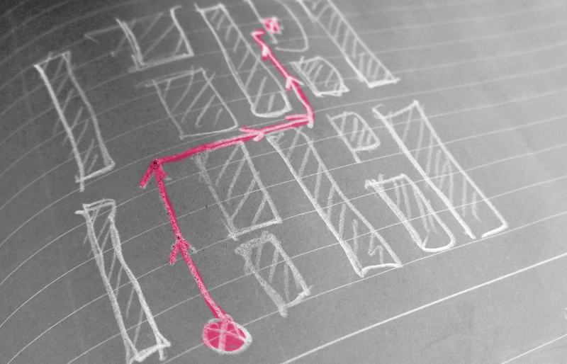
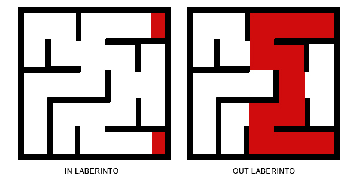
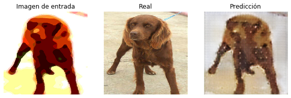
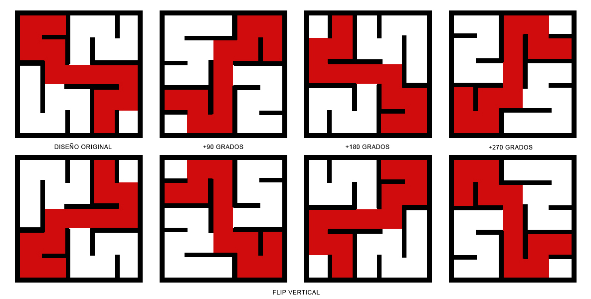
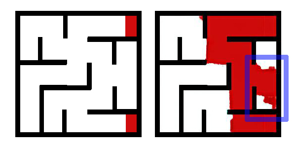
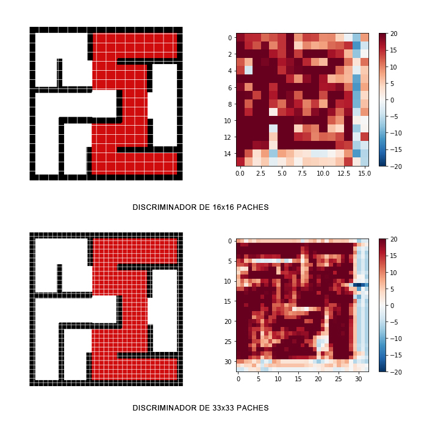
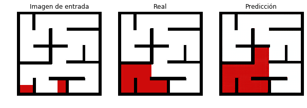
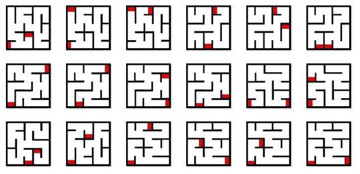

## Encontrar trayecto (proyecto DOT.CSV)
  

Hace unas semanas atrás me propusieron un proyecto que involucraba implementar un vehículo para personas de movilidad reducida en el entorno de un cementerio en Lima, además tenían la exigencia de que debiera ser automágicamente (aquí el AUTO está relacionado con el dispositivo de movilidad). El desafío era muy interesante y se resumía en encontrar  la ruta entre dos puntos: la puerta de entrada del cementerio y el nicho destino a visitar.  

Estaba casi convencido  de que podía  entrenar   una arquitectura de red neuronal con imágenes  del inicio y fin del recorrido, y si le mostraba la trayectoria final; ella luego podría aprender a encontrar las rutas con autonomía.

 
  

Pero tenía la dificultad que previamente,  debía  diseñar las muestras de entrenamiento. Hacerlo a escala real sería muy aventurado, considerando que era una prueba.  Definitivamente, lo más importante era la intención de experimentar con el sistema de Pix2pix. Así que deseche esta primera idea. Afortunadamente tenía guardadas unas fotos de perros que manipulé digitalmente para probar la arquitectura y estos fueron los resultados. [El código está aquí](https://drive.google.com/file/d/1sp3DznqkAn84sYy9AmnUfZ4Kw7MF6P1g/view?usp=sharing) . 
 
Con esta primera experiencia me decidí por retomar la primera idea. Pero era muy trabajoso tener que construir el set de datos. Así que abstraje la idea y la concentré en un pequeño laberinto que podría, girar y reflejar para aumentar los datos rápida y fácilmente. Con la idea persistente  de resultar no ser del todo efectiva.   
 
Inicialmente use unas 100 muestras y podría notar que si entrenaba adecuadamente. Definitivamente no esperaba una solución total, pero si un aproximación. A este punto es importante indicar que tenía problemas de acceso al internet,  así que todas las pruebas iníciales las desarrollé en mi laptop sin tarjeta gráfica.  Los entrenamientos tardaron unas 12 horas.  Cuando estaba seguro de que estaba en el rumbo correcto,  decidí ir a una cafetería conocida para entrenar al modelo en Colab en un par de horas.  

Una de las modificaciones intentaba solucionar el problema de algunas respuestas  que se desviaban del objetivo. 

 


Lo primero que deduje es que necesitaba un discriminador más grande, que tenga más resolución. La propuesta inicialmente tenía una forma de 16 x16 paches  y la propuesta final tiene 33x33. Además le estamos aplicando ZeroPadding2D(), como se puede apreciar en el [código](https://github.com/sandroormeno/proyecto_dotcsv/blob/master/laberinto.ipynb).

 


```python
def Discriminator():
    
    initializer = tf.random_normal_initializer(0., 0.02)

    ini = tf.keras.layers.Input(shape=[None, None, 3], name='input_img')
    gen = tf.keras.layers.Input(shape=[None, None, 3], name='gener_img')

    x = tf.keras.layers.concatenate([ini, gen]) # (bs, 256, 256, channels*2)

    down1 = downsample(64, False)(x)                   # (bs, 128, 128, 64)
    down2 = downsample(128)(down1)                     # (bs, 64, 64, 128)
    down3 = downsample(256)(down2)                     # (bs, 32, 32, 256)
    
    zero_pad1 = tf.keras.layers.ZeroPadding2D()(down3) # (bs, 34, 34, 256)    
    
    conv = tf.keras.layers.Conv2D(512, 4, strides=1,
                                kernel_initializer=initializer,
                                use_bias=False)(zero_pad1) # (bs, 31, 31, 512)
    
    batchnorm1 = tf.keras.layers.BatchNormalization()(conv)
    
    leaky_relu = tf.keras.layers.LeakyReLU()(batchnorm1)
    
    zero_pad2 = tf.keras.layers.ZeroPadding2D()(leaky_relu) # (bs, 33, 33, 512)
    
    last = tf.keras.layers.Conv2D(filters=1, 
                                  kernel_size=4, 
                                  strides=1,
                                  kernel_initializer=initializer,
                                  padding='same')(zero_pad2)  
   

    return tf.keras.Model(inputs=[ini, gen], outputs=last)
```  

Finalmente realicé el entrenamiento con [480 imágenes](https://drive.google.com/file/d/1sp3DznqkAn84sYy9AmnUfZ4Kw7MF6P1g/view?usp=sharing)  de laberintos, 90 de las cuales fueron para test, en 100 epocas.  Las trayectorias cortas se entrenaban en 20 épocas y las más largas en casi cien, pero debo confesar que aun tiene problemas con las trayectorias más largas. 

 

Y para terminar los probé con 18 nuevas imágenes. Desde luego eran rutas  cortas,  estos son los resultados. Ciertamente se puede mejorar pero agradezco a Dot.csv por la experiencia. 

 


[las imágenes usadas están aquí](https://drive.google.com/file/d/1sp3DznqkAn84sYy9AmnUfZ4Kw7MF6P1g/view?usp=sharing)  

